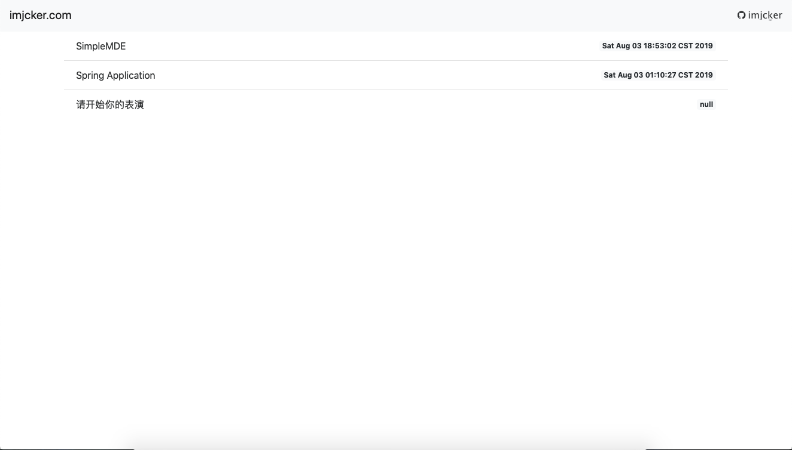
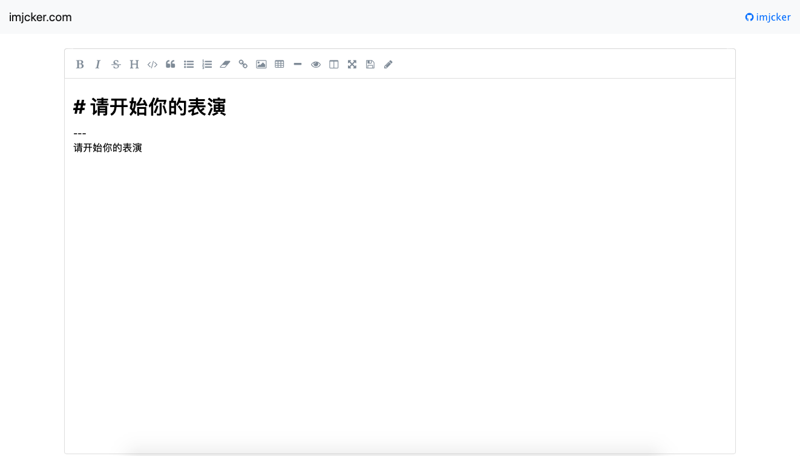
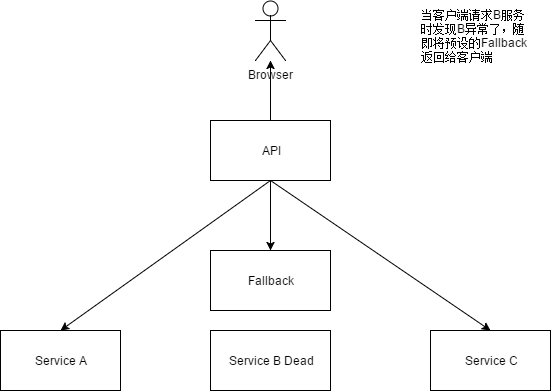
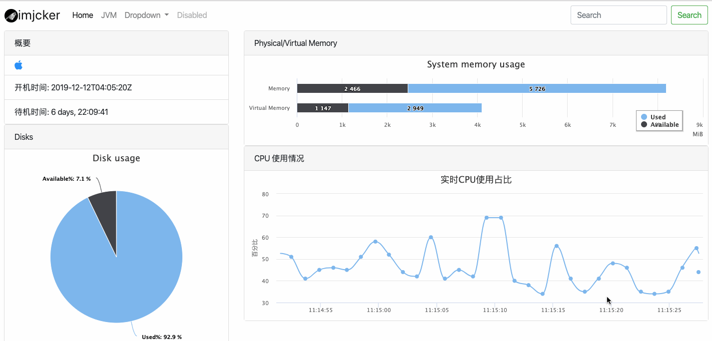

# 统一接口平台





* RabbitMQ

* hystrix
    
    
* redis cluster


# [Jcker](http://www.imjcker.com)
[Jcker](http://www.imjcker.com)一个简洁高效的开源博客

### 主页

### 博客页面


## 功能
* 响应式适应所有客户端
* Markdown在线发布博客
* WYSIWYG 所见即所得

## 使用
一键启动：nohup java -jar jcker.jar &

## Jcker技术栈
### 后台技术
* Spring boot
* H2
* GitHub oauth
### 前台技术
* Bootstrap4
* jQuery
* highlight
* simplemde
* jquery.twbsPagination
* jquery.datatables
## 联系方式
邮箱：helloalanturing@icloud.com
QQ群：363547584(聊骚群)
微信公众号：jcker


# sys-spring-boot-starter
[][license]
[](https://imjcker.github.io)

live server system information




## docker
run within docker by execute script below.
explanation: run service container as **monitor** and publish port on host server port **8081** or any other available ports you replace with. 
```shell script
sudo docker run -d --name monitor -p 8081:8080 imjcker/sys-spring-boot-starter:latest
```


[license]: https://www.apache.org/licenses/LICENSE-2.0
